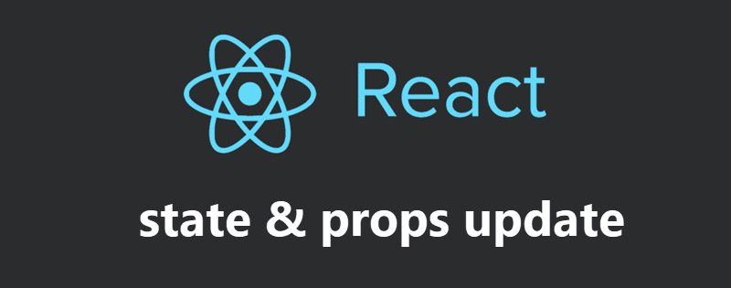
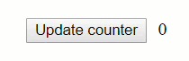
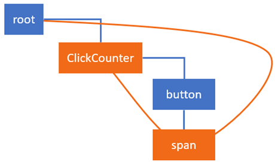
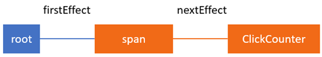

> 原文地址：https://medium.com/react-in-depth/in-depth-explanation-of-state-and-props-update-in-react-51ab94563311
>
> 原文作者：[Max Koretskyi aka Wizard](https://github.com/maximusk)



在我先前的文章[深入理解 React 中的新协调算法](https://medium.com/react-in-depth/inside-fiber-in-depth-overview-of-the-new-reconciliation-algorithm-in-react-e1c04700ef6e)中，我讲述了很多重要的内容，这为理解我将在本篇文章中提及的 React 更新机制奠定了基础。

我已经概述过将要在本文中使用的主要数据结构和概念，特别是 Fiber 节点，current 与 work in progress 树，副作用以及 effects 列表。我也对协调的主要算法进行过高度概括，而且还讲解了 **`render`** 和 **`commit`** 两个阶段的不同。如果你还没有读过这篇文章，那我建议你从这里开始。

同样的，我仍然会以能够在屏幕上增加数字的按钮作为示例程序：



你可以在线尝试这个[程序](https://stackblitz.com/edit/react-jwqn64)。我们实现了一个能够通过 **`render`** 方法返回两个子元素 **`button`** 和 **`span`** 的简单组件。当你点击按钮的时候，组件中的 state 会在处理程序内部更新。同时 **`span`** 元素中的文本内容也会更新：

```js

class ClickCounter extends React.Component {
    constructor(props) {
        super(props);
        this.state = {count: 0};
        this.handleClick = this.handleClick.bind(this);
    }

    handleClick() {
        this.setState((state) => {
            return {count: state.count + 1};
        });
    }
    
    componentDidUpdate() {}

    render() {
        return [
            <button key="1" onClick={this.handleClick}>Update counter</button>,
            <span key="2">{this.state.count}</span>
        ]
    }
}
```

在这里，我还将 **`componentDidUpdate`** 生命周期方法添加到了组件中。这是为了展示在 **`commit`** 阶段，React 是如何通过添加副作用来调用该方法的。

在本篇文章中我想向你展示 React 是如何执行 state 更新以及它是如何构建 effects 列表的。我们将会深入理解 **`render`** 阶段与 **`commit`** 阶段中的高级函数。

特别的，我们将在 React 源码的 [**`completeWork`**](https://github.com/facebook/react/blob/cbbc2b6c4d0d8519145560bd8183ecde55168b12/packages/react-reconciler/src/ReactFiberCompleteWork.js#L532) 函数中看到：

* 在 **`ClickCounter`** 组件的 **`state`** 中更新 **`count`** 属性
* 调用 **`render`** 方法以得到子元素列表然后进行协调比较
* 更新 **`span`** 元素中的 props

在 React 源码的 [**`commitRoot`**](https://github.com/facebook/react/blob/95a313ec0b957f71798a69d8e83408f40e76765b/packages/react-reconciler/src/ReactFiberScheduler.js#L523) 函数中：

* 更新 **`span`** 元素中的 **`textContent`** 属性
* 调用 **`componentDidUpdate`** 生命周期方法

但在这之前，让我们先快速理解一遍在 click 事件中调用 **`setState`** 方法后，React 是如何执行相应的工作的。

**请注意你并不需要知道该如何使用 React 。本篇文章讲解的是 React 的内部工作原理。**

## 调度更新

当我们点击 button 的时候，**`click`** 事件被触发，之后 React 就会执行我们传入 button props 中的回调函数。在我们的示例程序中只是简单地增加计数并且更新 state ：

```js
class ClickCounter extends React.Component {
    ...
    handleClick() {
        this.setState((state) => {
            return {count: state.count + 1};
        });
    }
} 
```

每一个 React 组件都有其对应的 **`updater`** 作为该组件与 React core 之间的桥梁。它让 React DOM ，React Native ，服务端渲染以及测试工具能够以不同的方式实现 **`setState`** 方法。

在本篇文章中，我们会了解到 React DOM 中的 updater 对象是如何实现的，其实它的核心就是 Fiber 协调器。对于 **`ClickCounter`** 组件来说对应的是 [**`classComponentUpdater`**](https://github.com/facebook/react/blob/6938dcaacbffb901df27782b7821836961a5b68d/packages/react-reconciler/src/ReactFiberClassComponent.js#L186) 。它主要负责检索 Fiber 实例，将更新放入队列以及调度相应的 work 。

当 state 更新在排队时，它们基本上就只是在等待被添加到 Fiber 节点需要执行的更新队列里去。在我们的例子中，对应着 **`ClickCounter`** 组件的 [Fiber 节点](https://medium.com/react-in-depth/inside-fiber-in-depth-overview-of-the-new-reconciliation-algorithm-in-react-e1c04700ef6e) 会有如下的结构：

```js
{
    stateNode: new ClickCounter,
    type: ClickCounter,
    updateQueue: {
         baseState: {count: 0}
         firstUpdate: {
             next: {
                 payload: (state) => { return {count: state.count + 1} }
             }
         },
         ...
     },
     ...
}
```

如你所见，在 **`updateQueue.firstUpdate.next.payload`** 里的函数是我们在 **`ClickCounter`** 组件中为 **`setState`** 方法传入的回调。它代表着第一次更新时需要在 **`render`** 阶段调用的函数。

## 处理 ClickCounter Fiber 节点的更新

在先前的文章中我提到过 [work loop](https://medium.com/react-in-depth/inside-fiber-in-depth-overview-of-the-new-reconciliation-algorithm-in-react-e1c04700ef6e) ，并且解释了全局变量 **`nextUnitOfWork`** 的作用。需要注意的是，这个变量保留着来自 **`workInProgress`** 树且带有 work 的 Fiber 节点的引用。当 React 在遍历整棵 Fiber 树时，它会根据这个变量来判断是否还有携带着未完成 work 的 Fiber 节点。

我们假设此时 **`setState`** 方法已经被调用。React 会将 **`setState`** 中的回调推入 **`ClickCounter`** Fiber 节点的 **`updateQueue`** 并开始调度相应的 work 。React 此时会进入 **`render`** 阶段。通过调用 [renderRoot](https://github.com/facebook/react/blob/95a313ec0b957f71798a69d8e83408f40e76765b/packages/react-reconciler/src/ReactFiberScheduler.js#L1132) 函数，它从最顶层的 **`HostRoot`** 节点开始遍历整棵 Fiber 树。然而，在这个过程中 React 会跳过那些已经被处理过的节点直到找到带有未完成 work 的 Fiber 节点。而此时我们仅有一个带有 work 的 Fiber 节点。它就是 **`ClickCounter`** Fiber 节点。

## beginWork

首先，让我们先来理解 [beginWork](https://github.com/facebook/react/blob/cbbc2b6c4d0d8519145560bd8183ecde55168b12/packages/react-reconciler/src/ReactFiberBeginWork.js#L1489) 函数。

> *因为在树中的每个 Fiber 节点里都会调用这个函数，所以如果你想在 **`render`** 阶段进行调试，那在这个函数中打断点是最合适不过了。我经常这样做并且会检查相应 Fiber 节点的类型以便找到我需要的那个。*

**`beginWork`** 函数基本上是由一个大的 `switch` 语句构成，它决定了对于标记过的 Fiber 节点来说哪种类型的 work 是需要被完成的，之后便会执行相应的函数去完成 work 。在我们的 **`ClickCounter`** 例子中它是一个 class 组件，所以该分支大概会像下面这样：

```js
function beginWork(current$$1, workInProgress, ...) {
    ...
    switch (workInProgress.tag) {
        ...
        case FunctionalComponent: {...}
        case ClassComponent:
        {
            ...
            return updateClassComponent(current$$1, workInProgress, ...);
        }
        case HostComponent: {...}
        case ...
}
```

让我们再深入到 [**`updateClassComponent`**](https://github.com/facebook/react/blob/1034e26fe5e42ba07492a736da7bdf5bf2108bc6/packages/react-reconciler/src/ReactFiberBeginWork.js#L428) 函数中去。取决于该组件是否为第一次渲染，重新恢复 work 还是一次 state 更新，React 要么创建一个实例并将其挂载到组件上要么就只进行 state 更新：

```js
function updateClassComponent(current, workInProgress, Component, ...) {
    ...
    const instance = workInProgress.stateNode;
    let shouldUpdate;
    if (instance === null) {
        ...
        // 在初次渲染时我们需要创建 class 实例
        constructClassInstance(workInProgress, Component, ...);
        mountClassInstance(workInProgress, Component, ...);
        shouldUpdate = true;
    } else if (current === null) {
        // 在恢复执行时，直接重用之前的 class 实例
        shouldUpdate = resumeMountClassInstance(workInProgress, Component, ...);
    } else {
        shouldUpdate = updateClassInstance(current, workInProgress, ...);
    }
    return finishClassComponent(current, workInProgress, Component, shouldUpdate, ...);
}
```

我们已经有了 **`ClickCounter`** 组件的实例，所以让我们来看下 [**`updateClassInstance`**](https://github.com/facebook/react/blob/6938dcaacbffb901df27782b7821836961a5b68d/packages/react-reconciler/src/ReactFiberClassComponent.js#L976) 这个函数。这正是 React 在 class 组件中处理大部分工作的地方。下面是在该函数中按顺序执行的最重要的几个操作：

* 调用 **`UNSAFE_componentWillReceiveProps()`** 钩子方法 ( 弃用 )
* 在 **`updateQueue`** 中处理更新并生成新的 state
* 调用带有新的 state 作为参数的 **`getDerivedStateFromProps`** 方法并返回最终的 state
* 调用 **`shouldComponentUpdate`** 方法来判断组件是否想要更新；如果返回 **`false`** ，则跳过整个渲染过程，包括在组件以及它的子组件上调用 **`render`** 方法；若返回 **`true`** 则进行组件更新。
* 调用 **`UNSAFE_componentWillUpdate`** 方法 ( 弃用 )
* 添加 effect 以便触发 **`componentDidUpdate`** 生命周期方法

> 虽然调用 **`componentDidUpdate`** 方法的 effect 是在 **`render`** 阶段添加的，但是该方法真正调用的时刻其实是在接下来的 **`commit`** 阶段。

* 在组件实例上更新 **`state`** 和 **`props`**

> 组件实例上的 **`state`** 和 **`props`** 应该在 **`render`** 方法调用之前更新，这是因为 **`render`** 方法最终的输出往往依赖于 **`state`** 和 **`props`** 。如果我们不进行更新的话，那么每次就只会返回相同的结果。

下面是该函数的简化版本：

```js
function updateClassInstance(current, workInProgress, ctor, newProps, ...) {
    const instance = workInProgress.stateNode;

    const oldProps = workInProgress.memoizedProps;
    instance.props = oldProps;
    if (oldProps !== newProps) {
        callComponentWillReceiveProps(workInProgress, instance, newProps, ...);
    }

    let updateQueue = workInProgress.updateQueue;
    if (updateQueue !== null) {
        processUpdateQueue(workInProgress, updateQueue, ...);
        newState = workInProgress.memoizedState;
    }

    applyDerivedStateFromProps(workInProgress, ...);
    newState = workInProgress.memoizedState;

    const shouldUpdate = checkShouldComponentUpdate(workInProgress, ctor, ...);
    if (shouldUpdate) {
        instance.componentWillUpdate(newProps, newState, nextContext);
        workInProgress.effectTag |= Update;
        workInProgress.effectTag |= Snapshot;
    }

    instance.props = newProps;
    instance.state = newState;

    return shouldUpdate;
}
```

我在上面的代码片段中删去了一些不必要的辅助代码。对于组件实例来说，在调用生命周期方法或者添加为触发这些方法的 effect 时，React 会检查组件中是否有 **`componentDidUpdate`** 方法，并且使用 **`typeof`** 操作符来判断。举个例子，React 是怎样在 effect 添加到组件实例之前去检查 **`componentDidUpdate`** 方法的。

```js
if (typeof instance.componentDidUpdate === 'function') {
    workInProgress.effectTag |= Update;
}
```

好的，现在我们知道在 render 阶段 React 为 **`ClickCounter`** Fiber 节点执行了哪些操作。接下来让我们看看这些操作是如何改变 Fiber 节点上的值。当 React 开始处理 work 时，**`ClickCounter`** 组件对应的 Fiber 节点会像下面这样：

```js
{
    effectTag: 0,
    elementType: class ClickCounter,
    firstEffect: null,
    memoizedState: {count: 0},
    type: class ClickCounter,
    stateNode: {
        state: {count: 0}
    },
    updateQueue: {
        baseState: {count: 0},
        firstUpdate: {
            next: {
                payload: (state, props) => {…}
            }
        },
        ...
    }
}
```

当 work 被处理完成后，我们又会得到一个新的 Fiber 节点：

```js
{
    effectTag: 4,
    elementType: class ClickCounter,
    firstEffect: null,
    memoizedState: {count: 1},
    type: class ClickCounter,
    stateNode: {
        state: {count: 1}
    },
    updateQueue: {
        baseState: {count: 1},
        firstUpdate: null,
        ...
    }
}
```

**请花一点时间观察这两个 Fiber 节点上属性的不同。**

在更新执行完之后，**`memoizedState`** 和 **`updateQueue.baseState`** 中的 **`count`** 属性都变为 1 。组件实例中的 state 也进行了更新。

在这个点上，队列中已经没有后续的更新操作，所以 **`firstUpdate`** 为 **`null`** 。更重要的是，我们发现 **`effectTag`** 属性也发生了改变。它的值从 **`0`** 变成了 **`4`** 。转换为二进制是 **`100`** ，这意味着设置了第三个位，而这正是 **`Update`** [副作用标记](https://github.com/facebook/react/blob/b87aabdfe1b7461e7331abb3601d9e6bb27544bc/packages/shared/ReactSideEffectTags.js)的位：

```js
export const Update = 0b00000000100;
```

总结一下，当 React 在处理 **`ClickCounter`** Fiber 节点时，会调用突变前的生命周期方法，更新 state 以及定义相关的 side-effects 。

## 协调 ClickCounter Fiber 下的子节点

当 **`ClickCounter`** Fiber 节点上的工作完成后，React 接下来会调用 [finishClassComponent](https://github.com/facebook/react/blob/340bfd9393e8173adca5380e6587e1ea1a23cefa/packages/react-reconciler/src/ReactFiberBeginWork.js#L355) 函数。在这里 React 会调用组件实例上的 **`render`** 方法并对从组件中返回的子节点使用 diff 算法进行比较。[文档](https://reactjs.org/docs/reconciliation.html#the-diffing-algorithm)中对该算法进行了高度概括。下面是其中的一部分：

> *当比较相同类型的 React 元素时，React 会观察两者的属性，保留相同的 DOM 节点，只更新那些发生改变的属性。*

如果再深入一点，我们会发现比较的其实是 React 元素上对应的 Fiber 节点。但我现在不会详细介绍，因为这个过程过于复杂。我会单独写一篇文章并将重点放在子节点的协调上。

> *如果你很着急想知道其中的细节，可以看看 [reconcileChildrenArray](https://github.com/facebook/react/blob/95a313ec0b957f71798a69d8e83408f40e76765b/packages/react-reconciler/src/ReactChildFiber.js#L732) 函数，因为在我们的应用程序中，**`render`** 方法最终会返回 React 元素的数组。* 

在这个点上有两件重要的事情需要我们理解。**首先**，当 React 在进行子节点的协调过程时，**它会为从 `render` 方法返回的子代 React 元素创建或更新相应的 Fiber 节点**。**`finishClassComponent`** 函数会返回当前 Fiber 节点的子节点的引用。而它会被分配给 **`nextUnitOfWork`** 并在之后的 work loop 中处理。**其次**，React 会将**更新子节点上的 props** 作为其父节点上 work 的一部分执行。为了做到这点，React 会使用从 **`render`** 方法返回的 React 元素中的数据。

例如，这是 React 在协调 **`ClickCounter`** Fiber 的子节点之前 **`span`** 元素对应的 Fiber 节点：

```js

{
    stateNode: new HTMLSpanElement,
    type: "span",
    key: "2",
    memoizedProps: {children: 0},
    pendingProps: {children: 0},
    ...
}
```

如你所见，**`memoizedProps`** 和 **`pendingProps`** 下的 **`children`** 此时都为 0 。下面是从 **`render`** 方法中返回的 **`span`** 元素对应的 React 元素的结构：

```js
{
    $$typeof: Symbol(react.element)
    key: "2"
    props: {children: 1}
    ref: null
    type: "span"
}
```

如你所见，在 Fiber 节点与 React 元素中的 props **是有所不同的**。在 [**`createWorkInProgress`**](https://github.com/facebook/react/blob/769b1f270e1251d9dbdce0fcbd9e92e502d059b8/packages/react-reconciler/src/ReactFiber.js#L326) 函数中会创建备用的 Fiber 节点，**React 会将 React 元素上更新的 props 复制到 Fiber 节点中去**。

因此，当 React 完成了对 **`ClickCounter`** 组件所有子节点的协调工作后，**`span`** Fiber 节点就会拥有更新过的 **`pendingProps`** 。此时就与 **`span`** React 元素中的 props 相匹配。

```js
{
    stateNode: new HTMLSpanElement,
    type: "span",
    key: "2",
    memoizedProps: {children: 0},
    pendingProps: {children: 1},
    ...
}
```

之后，当 React 在为 **`span`** Fiber 节点处理 work 时，会将 props 复制到 **`memoizedProps`** 中去并且添加相应的 effects 以便执行后续的 DOM 更新。

好的，这应该就是 React 在 render 阶段为 **`ClickCounter`** Fiber 节点所做的所有工作。因为 button 节点是 **`ClickCounter`** 组件的第一个子节点，它将会被分配给 **`nextUnitOfWork`** 变量。在 button 节点上并没有需要完成的 work ，因此 React 会直接移动到它的兄弟节点，也就是 **`span`** Fiber 节点。通过我[先前的文章](https://medium.com/react-in-depth/inside-fiber-in-depth-overview-of-the-new-reconciliation-algorithm-in-react-e1c04700ef6e)可以看到，这个过程是在 **`completeUnitOfWork`** 函数中进行的。

## 处理 Span Fiber 节点的更新

所以，变量 **`nextUnitOfWork`** 现在指向的是 **`span`** Fiber 的备用节点，React 开始完成在它上面的工作。与在 **`ClickCounter`** 上执行的步骤类似，我们从 [**`beginWork`**](https://github.com/facebook/react/blob/cbbc2b6c4d0d8519145560bd8183ecde55168b12/packages/react-reconciler/src/ReactFiberBeginWork.js#L1489) 函数开始。

因为我们的 **`span`** 节点属于 **`HostComponent`** 类型，所以这次在 switch 语句下的分支大概会像下面这样：

```js
function beginWork(current$$1, workInProgress, ...) {
    ...
    switch (workInProgress.tag) {
        case FunctionalComponent: {...}
        case ClassComponent: {...}
        case HostComponent:
          return updateHostComponent(current, workInProgress, ...);
        case ...
}
```

它会返回 [**`updateHostComponent`**](https://github.com/facebook/react/blob/cbbc2b6c4d0d8519145560bd8183ecde55168b12/packages/react-reconciler/src/ReactFiberBeginWork.js#L686) 函数，可以看到它与 class 组件的 **`updateClassComponent`** 函数是并行的。对于函数式组件来说对应的则是 **`updateFunctionComponent`** 函数。你可以在 [**`ReactFiberBeginWork.js`**](https://github.com/facebook/react/blob/1034e26fe5e42ba07492a736da7bdf5bf2108bc6/packages/react-reconciler/src/ReactFiberBeginWork.js) 文件中找到所有相关的函数。

## 协调 Span Fiber 下的子节点

在我们的例子中 **`updateHostComponent`** 函数的 **`span`** 节点并没有发生任何重要的事情。

当 **`beginWork`** 结束后，我们会进入到 **`completeWork`** 函数中去。但在这之前，React 需要更新 **`span`** Fiber 上的 **`memoizedProps`** 。你可能还记得在协调 **`ClickCounter`** 组件下的子节点时，React 会更新 **`span`** Fiber 节点上的 **`pendingProps`** 。

```js
{
    stateNode: new HTMLSpanElement,
    type: "span",
    key: "2",
    memoizedProps: {children: 0},
    pendingProps: {children: 1},
    ...
}
```

所以当 **`span`** Fiber 下的 **`beginWork`** 函数完成时，React 将更新 **`pendingProps`** 来匹配 **`memoizedProps`** ：

```js
function performUnitOfWork(workInProgress) {
    ...
    next = beginWork(current$$1, workInProgress, nextRenderExpirationTime);
    workInProgress.memoizedProps = workInProgress.pendingProps;
    ...
}
```

在这之后 React 会调用 **`completeWork`** 函数，它与先前的 **`beginWork`** 类似也是由 switch 语句构成：

```js
function completeWork(current, workInProgress, ...) {
    ...
    switch (workInProgress.tag) {
        case FunctionComponent: {...}
        case ClassComponent: {...}
        case HostComponent: {
            ...
            updateHostComponent(current, workInProgress, ...);
        }
        case ...
    }
}
```

因为我们的 **`span`** Fiber 节点是 **`HostComponent`** ，所以会调用 [**`updateHostComponent`**](https://github.com/facebook/react/blob/cbbc2b6c4d0d8519145560bd8183ecde55168b12/packages/react-reconciler/src/ReactFiberBeginWork.js#L686) 函数。在该函数中 React 大概会执行以下几个操作：

* 准备 DOM 的更新
* 将更新推入 **`span`** Fiber 中的 **`updateQueue`** 队列
* 添加 effect 以便执行后续的 DOM 更新

在这些操作执行以前，**`span`** Fiber 节点会像下面这样：

```js
{
    stateNode: new HTMLSpanElement,
    type: "span",
    effectTag: 0
    updateQueue: null
    ...
}
```

当所有的 work 完成后则会变成下面这样：

```js
{
    stateNode: new HTMLSpanElement,
    type: "span",
    effectTag: 4,
    updateQueue: ["children", "1"],
    ...
}
```

注意观察 **`effectTag`** 与 **`updateQueue`** 属性值的不同。**`effectTag`** 上的值由 **`0`** 变成了 **`4`** 。它的二进制是 **`100`** ，意味着它在第三位，对应着 **`Update`** side-effect 标记。这也是 React 将在 commit 阶段需要为此节点所做的唯一工作。**`updateQueue`** 字段携带着将在更新阶段使用的负载。

当 React 处理完 **`ClickCounter`** 以及子节点下的 work 后，在 **`render`** 阶段中的工作就基本完成了。现在可以将完整的备用树分配给在 **`FiberRoot`** 上的 **`finishedWork`** 属性。这是一棵需要被映射到屏幕上的新树。这个过程可以在 **`render`** 阶段完成后立刻执行或者在浏览器空闲的时候再次执行。

## Effects 列表

在我们的例子中，因为在 **`span`** 节点和 **`ClickCounter`** 组件上都有副作用存在，React 会在 **`span`** Fiber 节点上添加指向 **`HostFiber`** 中 **`firstEffect`** 属性的链接。

React 会在 [**`completeUnitOfWork`**](https://github.com/facebook/react/blob/d5e1bf07d086e4fc1998653331adecddcd0f5274/packages/react-reconciler/src/ReactFiberScheduler.js#L999) 函数中构建 effects 列表。下面是一棵带有为更新 **`span`** 节点文本内容以及在 **`ClickCounter`** 上调用 hooks 函数的 effects 的 Fiber 树：



这是带有 effects 的节点线性列表：



## Commit 阶段

这个阶段我们以 [**`completeRoot`**](https://github.com/facebook/react/blob/95a313ec0b957f71798a69d8e83408f40e76765b/packages/react-reconciler/src/ReactFiberScheduler.js#L2306) 函数开始。在开始之前，React 会把 **`FiberRoot`** 上的 **`finishedWork`** 属性设为 **`null`** ：

```js
root.finishedWork = null;
```

和 **`render`** 阶段不同的是，**`commit`** 阶段总是同步的因此它可以安全地更新 **`HostRoot`** 以提示 **`commit`** 阶段已经开始。

在 **`commit`** 阶段 React 会执行更新 DOM 的操作以及调用 post-mutation 生命周期方法比如 **`componentDidUpdate`** 。为了做到这一点，React 会遍历整个在 **`render`** 阶段就已经初始化完成的 effects 列表并且调用它们。

我们有在 **`render`** 阶段就已经定义好的 **`span`** 与 **`ClickCounter`** 节点的 effects ：

```js
{ type: ClickCounter, effectTag: 5 }
{ type: 'span', effectTag: 4 }
```

**`ClickCounter`** 的 effect tag 值为 **`5`** 转换为二进制为 **`101`** ，而这相当于 **`Update`** work 中的为 class 组件调用 **`componentDidUpdate`** 生命周期方法。最低有效位也代表着此时的 Fiber 节点在 **`render`** 阶段已经完成了所有的 work 。

**`span`** 的 effect tag 值为 **`4`** 转换为二进制为 **`100`** ，这定义了在 host 组件上的 DOM 更新工作。在我们的 **`span`** 元素中，React 会更新该元素上的 **`textContent`** 。

### 处理 effects

让我们来看看 React 是如何处理这些 effects 的。在 [**`commitRoot`**](https://github.com/facebook/react/blob/95a313ec0b957f71798a69d8e83408f40e76765b/packages/react-reconciler/src/ReactFiberScheduler.js#L523) 函数中包含了三个子函数：

```js
function commitRoot(root, finishedWork) {
    commitBeforeMutationLifecycles()
    commitAllHostEffects();
    root.current = finishedWork;
    commitAllLifeCycles();
}
```

在每个子函数中都实现了遍历整个 effects 列表并检查 effects 类型的方法。当 React 找到与该子函数目的相关的 effect 时就会立刻调用它。在我们的例子中，React 会调用 **`ClickCounter`** 组件下的 **`componentDidUpdate`** 生命周期方法并更新 **`span`** 元素上的文本内容。

第一个子函数 [**`commitBeforeMutationLifeCycles`**](https://github.com/facebook/react/blob/fefa1269e2a67fa5ef0992d5cc1d6114b7948b7e/packages/react-reconciler/src/ReactFiberCommitWork.js#L183) 寻找的是 **`Snapshot`** effect 并且会调用 **`getSnapshotBeforeUpdate`** 生命周期方法。但是，因为我们没有在 **`ClickCounter`** 组件中实现这个方法，所以 React 并没有在 **`render`** 阶段添加这个 effect 。因此在我们的例子中，这个函数不会做任何事情。

### 更新 DOM

下一步 React 会调用 [**`commitAllHostEffects`**](https://github.com/facebook/react/blob/95a313ec0b957f71798a69d8e83408f40e76765b/packages/react-reconciler/src/ReactFiberScheduler.js#L376) 函数。在这里 React 会让 **`span`** 元素中的文本从 **`0`** 变为 **`1`** 。而对于 **`ClickCounter`** Fiber 节点来说则没有需要完成的 work ，因为在该 class 组件上没有任何的 DOM 更新。

该函数的重点在于选择正确类型的 effect 并执行相应的操作。在我们的例子中，我们需要更新 **`span`** 元素下的文本，所以我们的 **`Update`** 分支会像下面这样：

```js
function updateHostEffects() {
    switch (primaryEffectTag) {
      case Placement: {...}
      case PlacementAndUpdate: {...}
      case Update:
        {
          var current = nextEffect.alternate;
          commitWork(current, nextEffect);
          break;
        }
      case Deletion: {...}
    }
}
```

通过调用 **`commitWork`** 函数，我们最终会进入 [**`updateDOMProperties`**](https://github.com/facebook/react/blob/8a8d973d3cc5623676a84f87af66ef9259c3937c/packages/react-dom/src/client/ReactDOMComponent.js#L326) 函数。它会接收在 **`render`** 阶段加在 Fiber 节点上的 **`updateQueue`** 负载，然后更新 **`span`** 元素的 **`textContent`** 属性：

```js

function updateDOMProperties(domElement, updatePayload, ...) {
  for (let i = 0; i < updatePayload.length; i += 2) {
    const propKey = updatePayload[i];
    const propValue = updatePayload[i + 1];
    if (propKey === STYLE) { ...} 
    else if (propKey === DANGEROUSLY_SET_INNER_HTML) {...} 
    else if (propKey === CHILDREN) {
      setTextContent(domElement, propValue);
    } else {...}
  }
}
```

在 DOM 更新执行完后，React 会将 **`finishedWork`** 树分配给 **`HostRoot`** 。这将备用树设置为了 current 树：

```js
root.current = finishedWork;
```

### 调用 post mutation 生命周期方法

最后一个子函数是 [**`commitAllLifeCycles`**](https://github.com/facebook/react/blob/d5e1bf07d086e4fc1998653331adecddcd0f5274/packages/react-reconciler/src/ReactFiberScheduler.js#L479) 函数。在这里 React 会调用 post mutation 生命周期方法。在 **`render`** 阶段，React 将 **`Update`** effect 添加到了 **`ClickCounter`** 组件上。这是 **`commitAllLifeCycles`** 函数寻找的 effects 之一并且会调用 **`componentDidUpdate`** 生命周期方法：

```js
function commitAllLifeCycles(finishedRoot, ...) {
    while (nextEffect !== null) {
        const effectTag = nextEffect.effectTag;

        if (effectTag & (Update | Callback)) {
            const current = nextEffect.alternate;
            commitLifeCycles(finishedRoot, current, nextEffect, ...);
        }
        
        if (effectTag & Ref) {
            commitAttachRef(nextEffect);
        }
        
        nextEffect = nextEffect.nextEffect;
    }
}
```

该函数同时也会更新 [refs](https://reactjs.org/docs/refs-and-the-dom.html) ，但我们并没有用到该功能。[**`commitLifeCycles`**](https://github.com/facebook/react/blob/e58ecda9a2381735f2c326ee99a1ffa6486321ab/packages/react-reconciler/src/ReactFiberCommitWork.js#L351) 函数被调用：

```js

function commitLifeCycles(finishedRoot, current, ...) {
  ...
  switch (finishedWork.tag) {
    case FunctionComponent: {...}
    case ClassComponent: {
      const instance = finishedWork.stateNode;
      if (finishedWork.effectTag & Update) {
        if (current === null) {
          instance.componentDidMount();
        } else {
          ...
          instance.componentDidUpdate(prevProps, prevState, ...);
        }
      }
    }
    case HostComponent: {...}
    case ...
}
```

在这里可以看到，当组件第一次渲染的时候 React 会调用 **`componentDidMount`** 生命周期方法。