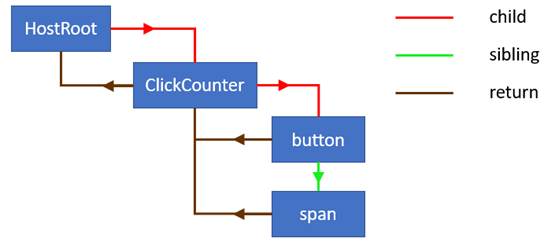

> 原文地址：https://medium.com/react-in-depth/inside-fiber-in-depth-overview-of-the-new-reconciliation-algorithm-in-react-e1c04700ef6e
>
> 原文作者：[Max Koretskyi aka Wizard](https://github.com/maximusk)


React 是一个用于构建用户界面的 JavaScript 库。它的核心在于能够检测组件状态中的变化并且能将更新状态映射到屏幕上。在 React 中我们把这个过程称作**协调**。当我们调用 `setState` 方法时，React 会检查是否有 `state` 或 `props` 变化并在 UI 上重新渲染组件。

React 文档给出了该协调机制的[高度概括](https://reactjs.org/docs/reconciliation.html)：React 元素、生命周期方法、`render` 方法以及用于组件子项的 diff 算法。从 `render` 方法中返回的不可改变的 React 元素树通常被称作 “virtual DOM” 。这个术语很早就帮助人们理解了 React ，但同时也带来了许多困惑，因而这个术语不再在 React 文档中使用。在本文中，我只会称其为 React 元素树。

除了 React 元素树，该框架中还有用来保持状态的内部实例（组件、DOM 节点等）树。从 React 16 版本开始，React 推出了该内部实例树的全新实现以及用来管理它的 **Fiber** 算法。如果想要了解 Fiber 架构所带来的好处请参考我之前的文章 [React 是怎样和为什么要在 Fiber 中使用链表](https://medium.com/react-in-depth/the-how-and-why-on-reacts-usage-of-linked-list-in-fiber-67f1014d0eb7)。

这是本系列的第一篇文章，旨在教会你 React 中的内部架构。在本文中，我想提供一些重要概念以及与 Fiber 算法有关数据结构的深入概述。一旦我们拥有了足够的知识储备，我们将会开始探究该算法的内部原理以及那些用于遍历和处理 fiber 树的重要函数。本系列的下一篇文章将会展示 React 是如何执行初始渲染和处理后续 `state` 与 `props` 更新的。从那里开始我们将继续讨论调度器的细节，即子协调过程，以及构建 `effects` 列表的机制。

我将在这里为你提供一些非常有深度的知识 🧙‍，我鼓励你阅读并理解 Concurrent React 的内部工作原理以及其背后的魔法。如果你想为 React 项目作出自己的贡献，本系列文章也将为你提供很好的指导。我十分热衷于[逆向工程](https://blog.angularindepth.com/level-up-your-reverse-engineering-skills-8f910ae10630)，所以本篇文章中将会有很多关于 React 源码的链接。

本篇文章的内容肯定有很多需要慢慢理解的地方，如果你不能够立即理解其中的某些东西，也不要感到有压力。

虽然会很耗费时间但这一切都是值得的。**请注意你不需要知道任何关于如何使用 React 的内容。本文讲解的是 React 内部是如何工作的。**

## 引言

下面是一个简单的应用程序，在本系列的文章中我都可能提到它。现在我们有一个可以用来增加屏幕上数字的按钮：


这是它的实现代码：

```jsx
class ClickCounter extends React.Component {
    constructor(props) {
        super(props);
        this.state = {count: 0};
        this.handleClick = this.handleClick.bind(this);
    }

    handleClick() {
        this.setState((state) => {
            return {count: state.count + 1};
        });
    }


    render() {
        return [
            <button key="1" onClick={this.handleClick}>Update counter</button>,
            <span key="2">{this.state.count}</span>
        ]
    }
}
```

正如你所见，这是一个简单的组件并且能从 `render` 方法中返回 `button` 和 `span` 两个子元素。当你点击按钮后，组件中的状态就会在内部被更新。反过来，这会导致 `span` 元素中的文本更新。

React 会在**协调**过程中进行很多活动。例如，在组件第一次渲染以及应用程序中的 `state` 更新后 React 会执行相应的高级操作：

* 更新 `ClickCounter` 组件 `state` 中的 `count` 属性。
* 检索并比较 `ClickCounter` 组件的子代和它们的 props
* 为 `span` 元素更新 props

在协调过程中，还有其他例如调用[生命周期方法](https://reactjs.org/docs/react-component.html#updating)和更新 [refs](https://reactjs.org/docs/refs-and-the-dom.html) 的操作执行。**所有的这些活动在 Fiber 架构中被统称为 “work” 。** work 的类型通常取决于 React 元素的类型。例如，对于 class 组件，React 需要创建一个实例，而对于函数组件就不需要这样做。正如你所了解的，在 React 中我们有许多类型的元素。例如 class 组件和函数组件，host 组件（DOM 节点）和 portals 等等。React 元素的类型由 `createElement` 函数的第一个参数定义。这个函数通常在 `render` 方法中用来创建元素。

在我们开始探究 React 中的内部活动和主要的 fiber 算法之前，让我们先熟悉一下 React 内部使用的数据结构。

## 从 React 元素到 Fiber 节点

React 中的每个组件都有一个用来展示 UI 的东西，它在 `render` 方法中被返回，通常被叫做视图或者模版。 下面是 `ClickCounter` 组件的模版： 

```jsx
<button key="1" onClick={this.onClick}>Update counter</button>
<span key="2">{this.state.count}</span>
```

### React 元素

一旦模版被 JSX 编译器编译，你就会得到一系列的 React 元素。它们才是 React 组件中 `render` 方法真正所返回的东西，而不是 HTML 。由于我们不一定需要使用 JSX ，故 `ClickCounter` 组件中的 `render` 方法也可以像下面这样重写：

```jsx
class ClickCounter {
    ...
    render() {
        return [
            React.createElement(
                'button',
                {
                    key: '1',
                    onClick: this.onClick
                },
                'Update counter'
            ),
            React.createElement(
                'span',
                {
                    key: '2'
                },
                this.state.count
            )
        ]
    }
}
```

在 `render` 方法中调用的 `React.createElement` 函数会创建像下面这样的两个数据结构：

```js

[
    {
        $$typeof: Symbol(react.element),
        type: 'button',
        key: "1",
        props: {
            children: 'Update counter',
            onClick: () => { ... }
        }
    },
    {
        $$typeof: Symbol(react.element),
        type: 'span',
        key: "2",
        props: {
            children: 0
        }
    }

```

可以看到 React 将 **[$$typeof](https://overreacted.io/why-do-react-elements-have-typeof-property/)** 属性添加到这些对象上，以便用来唯一标识 React 元素。然后我们有像 **`type`** 、**`key`** 和 **`props`** 这些用来描述元素的属性。这些值来自当调用 **`React.createElement`** 函数时传递的参数。请注意 React 是如何将文本内容表示为 **`span`** 和 **`button`** 节点的子项的。还有为什么点击事件会作为 **`button`** 元素中 props 的一部分。在 React 元素中还有其他的一些字段比如 **ref** ，但那已经超出本文所要介绍的内容了。

**`ClickCounter`** 的 React 元素上并没有 props 或者 key ：

```js
{
    $$typeof: Symbol(react.element),
    key: null,
    props: {},
    ref: null,
    type: ClickCounter
}
```

### Fiber 节点

在**协调**期间，从 `render` 方法中返回的每个 React 元素都会被合并到 fiber 节点树中去。每一个 React 元素都有其对应的 fiber 节点。与 React 元素不同的是，fibers 并不会在每次调用 `render` 方法后被重新创建。它们是持有组件状态和 DOM 节点的可变数据结构。

我们之前提到过 React 会根据 React 元素类型的不同来进行不同的活动。在我们的示例应用中，作为 class 组件的 **`ClickCounter`** 会调用生命周期方法以及 `render` 方法，而像 **`span`** 这样的 host 组件（DOM 节点）将会进行 DOM 的改变。因此每个 React 元素都会转换成相应类型的 Fiber 节点，它们用来描述需要被完成的工作。

**你可以将 fiber 想象为有某些工作要做的数据结构，或者换句话说，一个工作单位。Fiber 架构同时也为我们跟踪、调度、暂停和中止工作提供了便利。**

当 React 元素第一次被转换为 fiber 节点，React 通过 [createFiberFromTypeAndProps](https://github.com/facebook/react/blob/769b1f270e1251d9dbdce0fcbd9e92e502d059b8/packages/react-reconciler/src/ReactFiber.js#L414) 函数将元素中的数据用来创建 fiber 节点。在后续的更新中 React 会重用 fiber 节点并使用来自相应 React 元素的数据来更新必要的属性。

React 也可能根据 `key` prop 移动层次结构中的节点，或者删除某些 fiber 节点如果相应的 React 元素不再从 `render` 方法中返回的话。

> 想要了解现有 fiber 节点中所执行的所有活动列表和相应的函数，可以查看 [**ChildReconciler**](https://github.com/facebook/react/blob/95a313ec0b957f71798a69d8e83408f40e76765b/packages/react-reconciler/src/ReactChildFiber.js#L239) 函数。

因为 React 会为每个 React 元素创建相应的 fiber 节点，既然我们有 React 元素树，那我们也会有对应的 fiber 节点树。在这种情况下，我们的示例应用会像下面这样展示其 fiber 结构：



所有的 fiber 节点都通过链表连接，每个节点上都会有 **`child`** 、**`sibling`** 和 **`return`** 属性。如果想要理解为什么要这样设计，你可以参考我之前的文章 [React 是怎样和为什么要在 Fiber 中使用链表](https://medium.com/react-in-depth/the-how-and-why-on-reacts-usage-of-linked-list-in-fiber-67f1014d0eb7) 。

### current 树 与 work in progress 树

在第一次渲染结束后，React 会生成一棵将应用中的 state 映射到 UI 上的 fiber 节点树。而这棵树通常被称作 **current** 树。当 React 开始执行更新渲染时会创建一棵用于将未来的 state 映射到屏幕上的 **workInProgress** 树。

所有在 fibers 上进行的工作都会在 **`workInProgress`** 树中执行。当 React 遍历 **`current`** 树时，会为每个存在的节点创建一个构成 **`workInProgress`** 树的备用节点。该节点是通过 `render` 方法返回的 React 元素数据创建的。

当更新和相应的工作执行完毕后，React 就会拥有一棵备用树且随时准备映射到屏幕上。一旦 **`workInProgress`** 树在屏幕上被渲染，它也就变成了 **`current`** 树。

React 的核心原则之一是一致性。React 总是一次更新 DOM  — 它不会显示部分的结果。**`workInProgress`** 树就像草稿一样，对用户是不可见的，因此 React 可以先处理完所有组件，然后再将更新一次性映射到屏幕上。

在源码中你可以看见许多函数都需要从 **`current`** 和 **`workInProgress`** 树中获取 fiber 节点，比如下面这个函数：

```js
function updateHostComponent(current, workInProgress, renderExpirationTime) {...}
```

每个 fiber 节点在 **alternate** 字段中都保留着对应的另一棵树上节点的引用。例如 **`current`** 树上的节点指向 **`workInProgress`** 树中对应的节点，反之亦然。

### 副作用

我们可以把 React 组件想象成一个用 state 和 props 来计算最终 UI 是如何展示的函数。每个像操作 DOM 节点或调用生命周期方法的活动都应该被称作副作用又或是一次影响。[副作用](https://reactjs.org/docs/hooks-overview.html#%EF%B8%8F-effect-hook)在 React 文档中也被提到过。

> 在以前，你可能会在 React 组件中进行像数据获取、订阅数据源或者手动操作 DOM 等活动。我们把这些操作称为 “副作用” 因为它们会影响其他的组件并且在渲染过程中无法完成。

如你所见，大多数的 state 和 props 更新都将导致 “副作用” 的发生。既然执行副作用是一种类型的工作，那 fiber 节点除了用于更新外，它也可以作为跟踪 effects 的便利机制。每个 fiber 节点都有与之对应的 effects 。它们在 **`effectTag`** 字段中被编码。

因此 effects 代表着在处理更新后需要为实例完成的[工作](https://github.com/facebook/react/blob/b87aabdfe1b7461e7331abb3601d9e6bb27544bc/packages/shared/ReactSideEffectTags.js) 。对于 host 组件（DOM 节点）来说可能包含增加、更新和删除元素的工作。而对于 class 组件 React 可能会更新 refs 以及调用像 `componentDidMount` 和 `componentDidUpdate` 这样的生命周期方法。当然也有其他的 effects 对应着其他类型的 fiber 。

### Effects 列表

