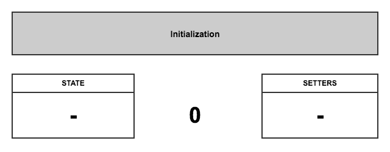
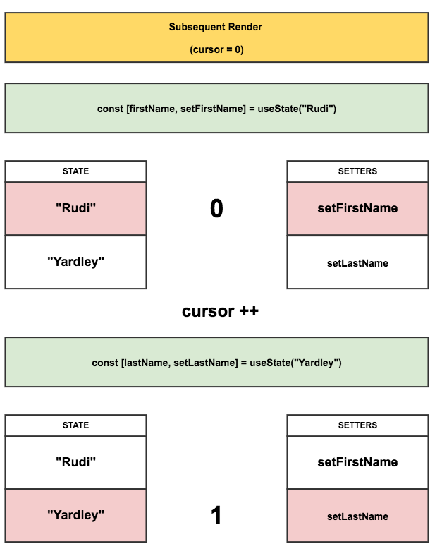
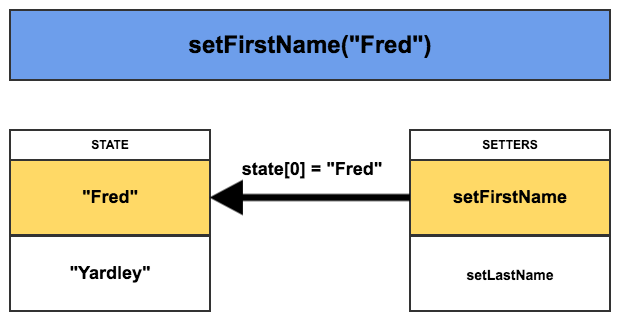
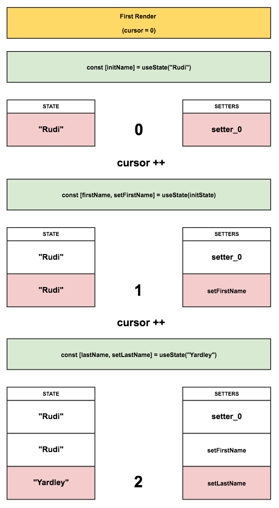

> 原文地址：https://medium.com/@ryardley/react-hooks-not-magic-just-arrays-cd4f1857236e
>
> 原文作者：[Rudi Yardley](https://github.com/ryardley) 

自从 React 发布 hooks API 以来，我就一直是它的忠实粉丝。然而，在使用它时却有一些[奇怪的约定](https://reactjs.org/docs/hooks-rules.html)需要遵守。

在这里，我准备了一个模型，用于那些在使用新的 API 时对这些约束的原因感到难以理解的人。

# 揭秘 hooks 的工作原理

我听说有人对新的 hooks API 提案感到十分困惑，因此我想尝试着解释这个新的语法提案是如何工作的，至少在表面层面上。

### hooks 的原则

React 核心团队规定你在使用 hooks 时需要遵守两个主要的使用规则，这在[官方文档](https://reactjs.org/docs/hooks-rules.html)中也有提到。

* **不要在循环语句、条件语句或者嵌套的函数中调用 Hooks**
* **只能在 React 函数组件中调用 Hooks** 

后者我认为是不言而喻的。要将行为添加到函数组件中去你就需要以某种方式将该行为与组件相关联。

然而我认为前者会感到令人困惑，因为使用这样的 API 编程似乎并不自然，而这就是我今天所要探索的内容。

### hooks 中的状态管理其实就是数组

为了得到更清晰理想的模型，我们先来看看 hooks API 的简单实现会长什么样子。

**请注意这只是猜测。为了展示你是如何思考 hooks 的，因此只有一种可能的方法来实现这个新的 API 。这不一定是 hooks 的内部工作原理。同样的，它只是一个提案。这一切都可能在未来发生变化。** 

### 我们该如何实现 useState() 呢？

为了演示 state hook 是如何工作的，我们首先来举个例子。

我们先从一个组件开始：

```jsx
function RenderFunctionComponent() {
  const [firstName, setFirstName] = useState("Rudi");
  const [lastName, setLastName] = useState("Yardley");

  return (
    <Button onClick={() => setFirstName("Fred")}>Fred</Button>
  );
}
```

hooks API 背后的思想其实就是你能够使用 hook 函数返回的第二个数组项作为 setter 函数，并且这个 setter 函数能够改变被 hook 所管理的 state 。

# 接下来 React 该做什么？

让我们来对 React 内部可能该如何工作进行猜测。hooks 会在进行渲染特定组件的执行上下文时工作。这意味着此处存储的数据位于正在渲染的组件之外的一个级别。这个 state 不与其他组件共享，但是它被保留在某个范围内，以便后续渲染的特定组件访问。

### 1) 初始化

创建两个空数组：`setters` 和 `states` 

设置 cursor 为 0



### 2) 首次渲染

第一次执行组件函数。

当组件首次渲染的时候，每次 `useState()` 调用，都会将一个 setter 函数 push 到 `setters` 数组中去（且与特定的 cursor 绑定）。与此同时，相应的 state 也会被 push 到 `states` 数组。


### 3) 后续渲染

在以后的每次渲染中，cursor 都会被重置，此时调用 `useState()` 就相当于用 cursor 作为索引读取 `setters` 和 `states` 数组中成对的值。



### 4) 事件处理

每个 setter 函数调用都可以通过对其 cursor 的引用改变 `states` 数组中对应位置的 state 值。



### 上述步骤的代码实现

```jsx
// hook.js
let state = [];
let setters = [];
let firstRun = true;
let cursor = 0;

function createSetter(cursor) {
  return function setterWithCursor(newVal) {
    state[cursor] = newVal;
  };
}

// 伪代码
export function useState(initVal) {
  // 当函数组件首次渲染执行完成后
  // firstRun 由 true 变为 false
  if (firstRun) {
    state.push(initVal);
    setters.push(createSetter(cursor));
    firstRun = false;
  }

  const setter = setters[cursor];
  const value = state[cursor];

  cursor++;
  return [value, setter];
}

// component.js
import { useState } from 'hook.js'

function RenderFunctionComponent() {
  const [firstName, setFirstName] = useState("Rudi"); // cursor: 0
  const [lastName, setLastName] = useState("Yardley"); // cursor: 1

  return (
    <div>
      <Button onClick={() => setFirstName("Richard")}>Richard</Button>
      <Button onClick={() => setFirstName("Fred")}>Fred</Button>
    </div>
  );
}

// 模拟 React 组件的渲染周期
function MyComponent() {
  cursor = 0; // 重置 cursor
  return <RenderFunctionComponent />; // 再次渲染
}

console.log(state); // 预渲染: []
MyComponent();
console.log(state); // 首次渲染: ['Rudi', 'Yardley']
MyComponent();
console.log(state); // 后续渲染: ['Rudi', 'Yardley']

// 点击 Fred 按钮

console.log(state); // 点击之后: ['Fred', 'Yardley']
```

# 为什么顺序很重要？

现在，如果我们根据某些外部因素甚至组件状态改变渲染周期中 hooks 的调用顺序会发生什么？

让我们来做一些 React 团队不让我们做的事情：

```jsx
let firstRender = true;

function RenderFunctionComponent() {
  let initName;
  
  if(firstRender){
    [initName] = useState("Rudi");
    firstRender = false;
  }
  const [firstName, setFirstName] = useState(initName);
  const [lastName, setLastName] = useState("Yardley");

  return (
    <Button onClick={() => setFirstName("Fred")}>Fred</Button>
  );
}
```

我们在条件语句中调用了 `useState()` ，让我们看看它在系统上造成的破坏。

### 首次渲染



目前来看我们的实例变量 `firstName` 和 `lastName` 含有正确的数据，但让我们看看第二次渲染时会发生什么：

### 第二次渲染


当我们的状态存储变得不一致时，变量 `firstName` 和 `lastName` 都被设置为 ”Rudi“ ，这显然是错误的并且这样的代码不起作用，但这也正解释了为什么使用 hooks 要遵循某些规则的原因。

### 想象一下 hooks 控制着一组数组，而你不会违背它指定的规则

现在你对为什么不能在循环或者条件语句中调用 `use` hooks 的原因应该很清楚了。因为我们面对的是指向一组数组的指针，如果你在渲染过程中改变了它们的调用顺序，cursor 的位置就不会和其对应的数据匹配，你的 use 调用也不会返回正确的 state 和 setter 函数。

# 结论

希望我对 hooks API 的工作原理给出了一个比较清晰易理解的模型。请记住，我真正想说的其实是要将关注点组合在一起，因此谨慎调用 hooks API 会让你的 React 应用变得更加可靠。

对于 React 组件来说 Hooks 是十分有效的工具。人们对它的出现感到兴奋是有原因的，如果你在使用它时考虑了组件中的状态是作为一组数组存在的模型，那么你就不应该违背它们的使用规则。

