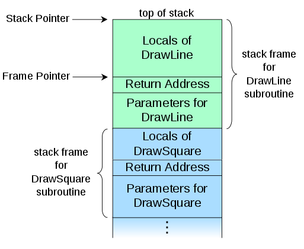
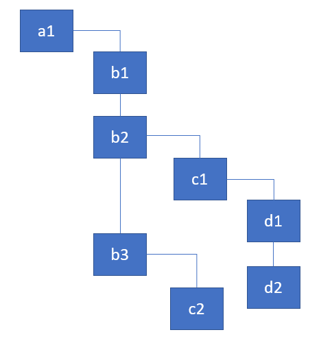
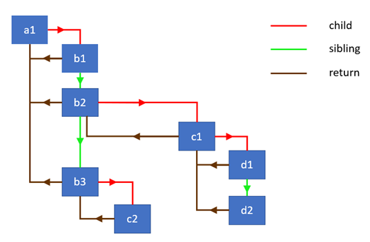

> 原文地址：https://medium.com/react-in-depth/the-how-and-why-on-reacts-usage-of-linked-list-in-fiber-67f1014d0eb7
>
> 原文作者：[Max Koretskyi aka Wizard](https://github.com/maximusk)

在 React 中，变化检测机制通常被称作协调或者渲染，而 Fiber 正是该机制的最新实现。得益于 Fiber 的底层架构，它让 React 有能力实现许多有趣的特性，例如执行非阻塞的渲染、根据优先级进行组件的更新以及在后台预渲染内容。这些特性在[并发 React 设计哲学](https://twitter.com/acdlite/status/1056612147432574976)中被称作 **time-slicing** 。

对于开发者来说，除了解决应用中的实际问题，**从工程角度来看，应用本身的内部实现同样具有广泛的吸引力。并且在应用的源码里也有着足够丰富的知识能够帮助我们成为真正的开发者。** 

如果你在 Google 上搜索 “React Fiber” ，你会发现很多与之相关的文章。但是除了 [Andrew Clark 的笔记](https://github.com/acdlite/react-fiber-architecture) 以外，其他都是十分高深的解释。在本篇文章中，我会引用该笔记中的某些内容并**对 Fiber 中一些特别重要的概念进行详细的阐述。** 在你读完整篇文章之后，你将会有足够的知识去理解 Lin Clark 在 [2017 年的 ReactConf](https://www.youtube.com/watch?v=ZCuYPiUIONs) 上所讲解的 work loop 模型。当然如果你能够花费时间去阅读源码，那对 Fiber 的理解就会更加透彻。

## 背景

Fiber 架构主要分为两个阶段：协调 / 渲染阶段与提交阶段。在 React 源码中协调阶段通常被称作“渲染阶段” 。在这个阶段中 React 会遍历整棵组件树然后执行以下的任务：

* 更新 state 和 props
* 调用生命周期钩子函数
* 检索当前组件树中的子元素
* 与先前组件树中的子元素进行比较
* 找出需要执行的 DOM 更新

**所有的这些活动在 Fiber 内部都被称作 work 。** 那些需要被完成的 work 类型取决于 React 元素的类型。例如，对于 `Class Component` 来说 React 需要实例化一个 class ，而 `Functional Component` 则不需要。如果你对它们感兴趣，[这里](https://github.com/facebook/react/blob/340bfd9393e8173adca5380e6587e1ea1a23cefa/packages/shared/ReactWorkTags.js#L29-L28)有 Fiber 中的所有 work 类型。这些活动正是 Andrew 提及过的：

> 在处理 UI 问题时，如果一次**执行太多的工作**，将会导致屏幕上的动画掉帧。

那么该如何理解这里的“一次执行所有工作”呢。好吧，基本上，如果 React 同步地去遍历整棵组件树然后再依次执行相应组件的 work ，应用中逻辑代码的执行时间可能就会超过有效的 16 ms 。而这正是造成掉帧和视图不一致的罪魁祸首。

那么有解决的办法吗？

> 在新的浏览器（以及 React Native）中实现的 API 正好可以帮助我们解决这个问题。

这个新的 API 叫做 [requestIdleCallback](https://developers.google.com/web/updates/2015/08/using-requestidlecallback) ，它能够生成一个函数队列，并在浏览器空闲的时候依次执行这个队列中的函数。下面是它的用法：

```js
requestIdleCallback((deadline)=>{
    console.log(deadline.timeRemaining(), deadline.didTimeout)
})
```

如果我把上面的代码放到浏览器的控制台中执行，Chrome 会输出 `49.9 false` 。这基本上代表着我还有 `49.9ms` 来完成我需要做的任何工作，并且我没有用完所有分配的时间，直到 `deadline.didTimeout` 变为 `true` 。需要注意的是 `timeRemaining` 会随着浏览器处理工作的频率而改变，因此需要不断地被检查。

> 事实上 **`requestIdleCallback`** 函数在有些时候会显得过于苛刻，并且经常会因为执行次数不够而导致 UI 渲染的不流畅，为此 React 团队不得不重新[实现他们自己的版本](https://github.com/facebook/react/blob/eeb817785c771362416fd87ea7d2a1a32dde9842/packages/scheduler/src/Scheduler.js#L212-L222)。

如果我们把 React 在组件中执行的所有活动放到 `performWork` 中去，然后使用 `requestIdleCallback` 函数去调度相应的 work ，我们的代码可能会像下面这样：

```js
requestIdleCallback((deadline) => {
    // 只要有足够的时间，就执行组件树中一部分的 work
    while ((deadline.timeRemaining() > 0 || deadline.didTimeout) && nextComponent) {
        nextComponent = performWork(nextComponent);
    }
})
```

我们在一个组件上执行其相应的 work 然后返回下一个需要被处理的组件的引用。同步地处理整棵组件树是不合理的，就像 React [先前实现的协调算法](https://reactjs.org/docs/codebase-overview.html#stack-reconciler)一样。Andrew 也提到了这个问题：

> *为了使用这些 API ，你需要一种方法将渲染时的 work 拆分为增量单位。*

为了解决这个问题，React 团队不得不重新实现遍历组件树的算法，将其**从依赖于内置栈的同步递归模型转换为基于链表和指针的异步模型**。而这正是 Andrew 在下面所写到的：

> *如果依赖于内置的调用栈，React 将会持续地工作直到栈被清空…… 如果我们可以随时中断调用栈并且还能手动操作调用帧，那不是很好吗？而这正是 React Fiber 想要达到的目标。**Fiber 是对先前基于栈的协调算法的重新实现，且专门用于 React 组件。** 你可以把单个 fiber 想象成一个虚拟的栈帧。* 

这就是我马上将要解释的内容。

### 关于栈的解释

我假设读者对栈的概念都很熟悉。如果你的代码在断点处停止，那么在浏览器的 debugging 工具上显示的就会是一个类似栈的东西。以下是[维基百科](https://en.wikipedia.org/wiki/Call_stack?fbclid=IwAR06VWEQnwoEawg0NsoR8loBJwIbmPWsXXKqbAuOFBjkawHThK7zlIBsJ_U#Structure)上的一些相关引用和图表：

> *在计算机科学中，**调用栈**是一种栈的数据结构，它储存着有关计算机活动子程序的信息。使用调用栈的主要原因是为了跟踪每个活动子程序在执行完成时应该返还控制的点。**调用栈**由许多个**栈帧**组合而成，每个栈帧对应着一个暂未以 **return** 语句终止的子程序调用。例如，如果一个名为 `DrawLine` 的子程序正在执行，并且它是被叫做 `DrawSquare` 的子程序调用的，那么在调用栈顶部的内容可能就会像下面所展示的图片一样。*



### 为什么栈会与 React 相关？

正如我们在本文第一部分所定义的，React 会在协调 / 渲染阶段遍历整棵组件树并且会为组件执行相应的 work 。先前的协调算法使用的是依赖于内置栈的同步递归模型来遍历整棵树。关于协调[官方文档](https://reactjs.org/docs/reconciliation.html#recursing-on-children)讲述了整个过程并且谈论了许多关于递归的内容：

> *默认情况下，当对 DOM 节点的子节点进行递归时，React 会同时迭代子节点的列表，并且在产生差异时生成突变。* 

你可以这样想，每次的递归调用都会向栈中增加一个帧，并且这个过程是同步的。假设我们有以下的组件树：



我们用 `render` 函数代表对象。你可以将它们视为组件的实例：

```js
const a1 = {name: 'a1'};
const b1 = {name: 'b1'};
const b2 = {name: 'b2'};
const b3 = {name: 'b3'};
const c1 = {name: 'c1'};
const c2 = {name: 'c2'};
const d1 = {name: 'd1'};
const d2 = {name: 'd2'};

a1.render = () => [b1, b2, b3];
b1.render = () => [];
b2.render = () => [c1];
b3.render = () => [c2];
c1.render = () => [d1, d2];
c2.render = () => [];
d1.render = () => [];
d2.render = () => [];
```

React 需要遍历整棵树并且为每个组件执行其相应的 work 。为了简化整个过程，在这里我们只是打印出当前组件的名称然后继续检索其子组件。下面是我们基于递归实现的遍历算法。

### 递归遍历

遍历整棵树的主函数叫做 `walk` ，下面是它的实现：

```js
walk(a1);

function walk(instance) {
    doWork(instance);
    const children = instance.render();
    children.forEach(walk);
}

function doWork(o) {
    console.log(o.name);
}
```

这是我们将要得到的结果：

**`a1, b1, b2, c1, d1, d2, b3, c2`**

如果你对递归并不是那么熟悉，可以看看我之前的文章[深入讲解递归](https://medium.freecodecamp.org/learn-recursion-in-10-minutes-e3262ac08a1)。

在遍历树时使用递归方法是非常直观且合适的。但正如我们先前所知道的，它也有一定的局限性。其中最大的问题在于我们不能将 work 拆分为许多小的增量单位。我们不能暂停特定组件上的 work 并在之后继续恢复执行。使用递归的方法，React 只能持续迭代执行所有组件上的 work 直到整个栈被清空。

**那么 React 将如何在不使用递归的情况下实现遍历组件树的算法呢？其实就是使用单链表树遍历算法。它让暂停遍历和停止栈的增长成为可能。**

### 链表遍历

我很有幸能够找到 Sebastian Markbåge 对该算法的主要[概述](https://github.com/facebook/react/issues/7942#issue-182373497)。为了实现这个算法，我们需要一个包含三个字段的数据结构：

* child — 第一个子节点的引用
* sibling — 第一个兄弟节点的引用
* return — 父节点的引用

在 React 新协调算法的上下文中，包含这些字段的数据结构被叫做 Fiber 。在底层它们代表着 React 元素并且携带着相应的 work 队列。我将在之后的文章中详细介绍 Fiber 。

下图展示了通过链表链接的对象层次结构以及它们之间的连接类型：



首先让我们来定义一个自定义节点的构造函数：

```js
class Node {
    constructor(instance) {
        this.instance = instance;
        this.child = null;
        this.sibling = null;
        this.return = null;
    }
}
```

然后我们创建一个接收节点数组并将所有节点链接在一起的函数。我们将使用这个函数来链接从 `render` 方法中返回的子节点。

```js
function link(parent, elements) {
    if (elements === null) elements = [];

    parent.child = elements.reduceRight((previous, current) => {
        const node = new Node(current);
        node.return = parent;
        node.sibling = previous;
        return node;
    }, null);

    return parent.child;
}
```

上面的函数会从最后一个节点开始遍历节点数组并将它们链接在一个单独的链表中。它将返回链表中第一个兄弟节点的引用。下面是一个展示该函数是如何工作的简单示例：

```js
const children = [{name: 'b1'}, {name: 'b2'}];
const parent = new Node({name: 'a1'});
const child = link(parent, children);

console.log(child.instance.name === 'b1');
console.log(child.sibling.instance === children[1]);
```

我们还实现了一个辅助函数用于为节点执行其相应的 work 。在这个例子中，我们只是打印出组件的名称。但同时也会检索组件的子代并将它们链接起来：

```js
function doWork(node) {
    console.log(node.instance.name);
    const children = node.instance.render();
    return link(node, children);
}
```

好的，现在我们已经准备好实现主要的遍历算法了。它是一个以父节点优先，深度优先的遍历算法。下面是它的代码实现且包含着有用的注释：

```js
function walk(o) {
    let root = o;
    let current = o;

    while (true) {
        // 为节点执行 work ，检索并链接该节点的所有子节点
        let child = doWork(current);
        
        // 如果有子节点的话，则将其设为 current 节点
        if (child) {
            current = child;
            continue;
        }
        
        // 如果我们回到了最顶部，则结束 walk 函数
        if (current === root) {
            return;
        }

        // 一直迭代下去直到找到兄弟节点
        while (!current.sibling) {

            // 如果我们回到了最顶部，则结束 walk 函数
            if (!current.return || current.return === root) {
                return;
            }

            // 将父节点设为 current 节点
            current = current.return;
        }

        // 如果存在兄弟节点，则将其设为 current 节点
        current = current.sibling;
    }
}
```

虽然这个算法看起来并不是特别难以理解，但你可能仍需要多花一点时间才能真正搞定它。你可以[在线调试](https://stackblitz.com/edit/js-tle1wr)它。我们的想法是持有对当前节点的引用并且能够在遍历树时将其重新赋值。之后我们再用 `return` 指针返回到公共的父节点。

如果我们现在来看此时的调用栈，下面就是我们将要看到的内容：


如你所见，当我们往下遍历树时，调用栈并不会继续增长。如果我们在 `doWork` 函数中添加打印节点名的代码，结果将会像下面这样：


**它就像是浏览器中的调用栈。**因此使用这种算法，我们可以有效的实现自己的浏览器调用栈。而这正是 Andrew 所讲到的：

> *Fiber 其实是栈的重新实现，只是专门用于 React 组件。你可以把 fiber 想象为一个虚拟栈帧。*

因为我们现在能够通过持有类似于顶部栈帧的引用来控制整个栈：

```js
function walk(o) {
    let root = o;
    let current = o;

    while (true) {
            ...

            current = child;
            ...
            
            current = current.return;
            ...

            current = current.sibling;
    }
}
```

所以我们可以在任何时候中断遍历并在之后将其恢复。而这正是我们想要使用新的 `requestIdleCallback` API 实现异步渲染的先决条件。

## React 中的 work loop

React 中 work loop 的[实现代码](https://github.com/facebook/react/blob/95a313ec0b957f71798a69d8e83408f40e76765b/packages/react-reconciler/src/ReactFiberScheduler.js#L1118)在这里：

```js
function workLoop(isYieldy) {
    if (!isYieldy) {
        // 刷新 work 且不会暂停
        while (nextUnitOfWork !== null) {
            nextUnitOfWork = performUnitOfWork(nextUnitOfWork);
        }
    } else {
        // 刷新异步的 work 直到限定的时间耗尽
        while (nextUnitOfWork !== null && !shouldYield()) {
            nextUnitOfWork = performUnitOfWork(nextUnitOfWork);
        }
    }
}
```

如你所见，它很好地对应了上面我们自己实现的算法。在 `nextUnitOfWork` 变量中持有着作为顶部栈帧的当前 fiber 节点的引用。

该算法能够**同步地**遍历整棵组件树并为每一个在树中的 fiber 节点 ( nextUnitOfWork ) 执行相应的 work 。通常在由 UI 事件 ( click、input、etc... ) 引起的用户交互更新时我们会这么做。我们还可以**异步地**遍历整棵组件树，同时检查当一个 fiber 节点执行完相应的 work 后是否还有剩余的时间为下个 fiber 节点执行 work 。函数 `shouldYield` 返回的结果是基于 [deadlineDidExpire](https://github.com/facebook/react/blob/95a313ec0b957f71798a69d8e83408f40e76765b/packages/react-reconciler/src/ReactFiberScheduler.js#L1806) 和 [deadline](https://github.com/facebook/react/blob/95a313ec0b957f71798a69d8e83408f40e76765b/packages/react-reconciler/src/ReactFiberScheduler.js#L1809) 变量，而它们会在 React 为 fiber 节点执行 work 时不断更新。

**`performUnitOfWork`** 函数将在[下篇文章](https://medium.com/react-in-depth/inside-fiber-in-depth-overview-of-the-new-reconciliation-algorithm-in-react-e1c04700ef6e#1a7d)中详细介绍。