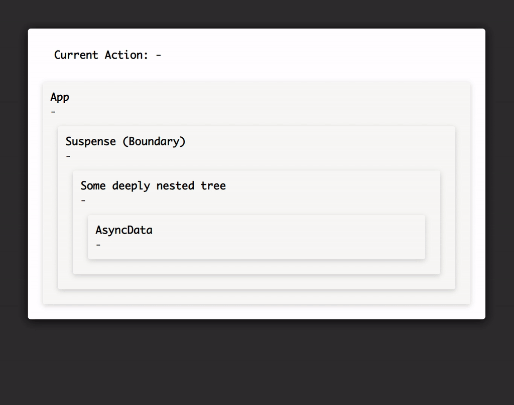

> 原文地址：https://medium.com/react-in-depth/why-react-suspense-will-be-a-game-changer-37b40fea71ec
>
> 原文作者：[Julian Burr](https://github.com/julianburr)

在本篇文章中，我不想太深入解释有关 React Suspense 的实现细节和它内部的工作原理，因为已经有[很多](https://auth0.com/blog/time-slice-suspense-react16/)[优秀的](https://hackernoon.com/building-a-polyfill-for-react-suspense-f1c7baf18ca1)[博客文章](https://reactjs.org/blog/2018/03/01/sneak-peek-beyond-react-16.html)、[视频](https://www.youtube.com/watch?v=SCQgE4mTnjU)和[讨论](https://www.youtube.com/watch?v=z-6JC0_cOns)做过这些事情了。相反，我更愿意把重点放在 Suspense 将会如何影响在应用开发时我们对加载状态和架构应用的思考。

## Suspense 简要介绍

鉴于有些人可能没有听说过 Suspense 或者根本不了解它，因此我会先给出一个关于 Suspense 的简要总结。

在去年冰岛举行的 JSConf 大会上，Dan Abramov 介绍了 Suspense 。在解决 React 应用中有关异步数据获取的难题时，Suspense 被称作是对开发者体验极大改进的 API 。这是件很令人兴奋的事情，因为每个正在构建动态 web 应用的开发者都知道这是一个主要痛点，并且也是带来巨大样版代码的原因之一。

Suspense 同样会改变我们对加载状态的思考方式，它不应该与加载组件或者数据源耦合，而应以 UI 关注点存在。我们的应用应该在用户体验中显示有意义的 spinner 。Suspense 通过解耦以下关注点帮助我们实现这一点：

**Suspense 并不关心你暂停（多少次）的原因，因此一个简单的 spinner 就能和代码分割、数据加载、图片加载等场景组合在一起。无论下面的树需要什么。如果网络速度足够快，甚至可以不显示 spinner 。**

Suspense 不仅在数据加载时有用，它甚至可以被应用到任何异步数据流中去。例如代码分割或图片加载。`React.lazy` 结合 `Suspense` 组件在 React 最新稳定版本中已经可以使用，这允许我们进行动态导入的代码分割，而无需手动处理加载状态。包含数据加载功能在内的完整 Suspense API 将会在今年之内发布，不过你可以通过 alpha 版本提前使用它。

Suspense 的设计思想是让组件具有“暂停”渲染的能力，例如，组件需要从外部资源中加载额外数据时。等到数据都加载完成，React 才会尝试重新渲染组件。

React 使用 Promise 来实现该功能。组件能在 render 方法调用时抛出 Promise（或者任何在组件渲染时调用的方法，例如，新的静态方法 `getDerivedStateFromProps` ）。React 会捕获 Promise 并沿着组件树往上寻找最近的 `Suspense` 组件，并且它会充当一种边界。`Suspense` 组件接收一个名为 `fallback` 的 prop，只要它的子树中有任何组件处于暂停状态，`fallback` 中的组件就会立即被渲染。

React 还会跟踪抛出的 Promise 。组件中的 Promise 一旦 resolve ，React 就会尝试去继续渲染该组件。因为我们假定由于 Promise 已经被 resolve ，这也就意味着暂停的组件已经具有正确渲染所需的全部数据。为此，我们使用某种形式的缓存来存储数据。该缓存取决于每次渲染时数据是否可用（如果可用就会像从变量中取值一样读取它），若数据没有准备好，则会触发 fetch 然后抛出 Promise 以便 React 捕获。如上所述，这并不是数据加载所独有的，任何可以使用 Promise 来描述的异步操作都可以充分利用 Suspense ，显然代码分割是一个非常明显且流行的例子。

Suspense 的核心概念与[错误边界](https://reactjs.org/docs/error-boundaries.html)非常相似。而错误边界在 React 16 中被介绍为能够在应用的任何地方捕捉未捕获的异常，同样的它通过在树中放置组件（在这种情况下为任何带有 componentDidCatch 生命周期方法的组件）来处理从该组件下面抛出的所有异常。无独有偶，`Suspense` 组件捕获任何由子组件抛出的 Promise ，不同的是我们并不需要一个特定的组件来充当边界，因为 `Suspense` 组件自己就是，它可以让我们定义 `fallback` 来决定后备的渲染组件。



这样的功能显著地简化了我们对应用中加载状态的思考方式并且让我们作为开发者的心智模型与 UX 和 UI 设计师更加一致。

设计师通常并不会考虑数据源，而是更多的考虑用户界面或应用程序的逻辑组织和信息层次结构。你知道还有谁不在意数据源吗？答案是用户。没有人会喜欢成千上万个加载时的 spinner ，并且其中的一些只会闪烁几毫秒，当数据加载完成时，页面内容将会上下跳动。

## 为什么 Suspense 被称作是巨大的突破呢？

### 问题

为了理解 Suspense 为什么能逆转游戏规则，让我们先来看看目前我们是如何处理应用中的数据加载。

最原始的方法就是在局部状态中储存所有需要的信息，代码可能会像下面这样：

```jsx
class DynamicData extends Component {
  state = {
    loading: true,
    error: null,
    data: null
  };

  componentDidMount () {
    fetchData(this.props.id)
      .then((data) => {
        this.setState({
          loading: false,
          data
        });
      })
      .catch((error) => {
        this.setState({
          loading: false,
          error: error.message
        });
      });
  }

  componentDidUpdate (prevProps) {
    if (this.props.id !== prevProps.id) {
      this.setState({ loading: true }, () => {
        fetchData(this.props.id)
          .then((data) => {
            this.setState({
              loading: false,
              data
            });
          })
          .catch((error) => {
            this.setState({
              loading: false,
              error: error.message
            });
          });
      });
    }
  }

  render () {
    const { loading, error, data } = this.state;
    return loading ? (
      <p>Loading...</p>
    ) : error ? (
      <p>Error: {error}</p>
    ) : (
      <p>Data loaded 🎉</p>
    );
  }
}
```

这看起来很啰嗦，是吧？

我们在组件 mount 时加载数据并储存到局部状态中。此外，我们还通过局部状态来跟踪错误和加载状态。这看起来很熟悉不是吗？即使你没有在使用 state 而是某种抽象，但很可能仍有很多加载三元组分散在你的应用程序中。

我并不认为这种方法本身是错误的（它可以满足简单用例的需求，并且我们可以很容易地优化它，例如先将请求数据的逻辑分离到新的方法中），虽然它不能很好地扩展，但开发者体验肯定会变得更好。为了具体阐述，我列出了此种方法存在的某些问题：

#### 1. 👎 丑陋的三元组 → 糟糕的 DX

在 render 方法中加载和错误状态通过三元组定义，这使我们的代码变得不必要的复杂化。我们不是在描述 render 函数，而是在描述组件树。

#### 2. 👎 样板代码 → 糟糕的 DX 

为了管理所有的状态我们不得不写很多样板代码：在 mount 时请求数据，成功时更新 loading 状态和存储数据到 state 或者失败时存储错误信息。我们会为每个需要外部数据的组件重复上面所有的步骤。

#### 3. 👎 受限数据和加载状态 → 糟糕的 DX & UX

我们会发现状态的处理和存储全都在一个组件内，这也就意味着应用中将会存在其他很多需要加载数据的 spinner ，如果我们有依赖于相同数据的不同组件，此时就会产生很多不必要的 API 调用代码。这回到了我之前提出的观点，使加载状态依赖于数据源的心智模型似乎并不正确。通过这种方法我们发现加载状态与数据加载以及组件强耦合在一起，这限制了我们只能在组件内处理问题（或者使用 hack 解决它），而不能够在更广泛的应用场景中使用它。

#### 4. 👎 重新获取数据 → 糟糕的 DX

改变 id 后则需要重新获取数据的逻辑是种很冗余的实现。我们既要在 `componentDidMount` 中初始化数据还要额外的在 `componentDidUpdate` 中检查 id 是否改变。

#### 5. 👎 闪烁的 spinner → 糟糕的 DX

如果用户的网速足够快，显示只出现几毫秒的 spinner 比什么也不显示要糟糕的多，这让你的应用变得笨拙且缓慢。因此感知性能才是关键。

---

现在你知道这种模式的不足之处了吗？对于许多人来说这并不令人感到惊讶，但对于我而言，实际上并没有说明开发人员和用户体验的具体情况。

因此，既然我们明确了问题所在，那么该如何解决它们呢？

### 用 Context 改进 

在很长的一段时间内 Redux 一直是上述问题的解决方案。但随着 React 16 版本新的 ”[Context API](https://reactjs.org/docs/context.html)“ 发布，我们又有了另一个很好的工具帮助我们在全局定义和暴露数据，同时能够在深嵌套的组件树中轻松访问它们。因此为了简单起见，我们将在这里使用后者。

首先，我们将原本储存在组件 state 中的所有数据转换到 context provider 中去，以方便其他组件共享该数据。我们也可以通过 provider 暴露加载数据的方法，这样我们的组件只需触发该方法然后通过 context consumer 读取加载后的数据。最近的 React 16.6 版本发布的 `contextType` 使得它更加优雅，不那么繁琐。

provider 还可用作缓存形式，如果数据已经存在或者被其他组件触发即正在加载中，此时便可以避免多次不必要的网络请求。

```jsx
const DataContext = React.createContext();

class DataContextProvider extends Component {
  // 我们想在该 provider 中储存多种数据
  // 因此我们用唯一的 key 作为每个数据集对象的键名
  // 加载状态
  state = {
    data: {},
    fetch: this.fetch.bind(this)
  };

  fetch (key) {
    if (this.state[key] && (this.state[key].data || this.state[key].loading)) {
      // 数据要么已经加载完成，要么正在加载中，因此没有必要再次请求数据
      return;
    }

    this.setState(
      {
        [key]: {
          loading: true,
          error: null,
          data: null
        }
      },
      () => {
        fetchData(key)
          .then((data) => {
            this.setState({
              [key]: {
                loading: false,
                data
              }
            });
          })
          .catch((e) => {
            this.setState({
              [key]: {
                loading: false,
                error: e.message
              }
            });
          });
      }
    );
  }

  render () {
    return <DataContext.Provider value={this.state} {...this.props} />;
  }
}

class DynamicData extends Component {
  static contextType = DataContext;

  componentDidMount () {
    this.context.fetch(this.props.id);
  }

  componentDidUpdate (prevProps) {
    if (this.props.id !== prevProps.id) {
      this.context.fetch(this.props.id);
    }
  }

  render () {
    const { id } = this.props;
    const { data } = this.context;

    const idData = data[id];

    return idData.loading ? (
      <p>Loading...</p>
    ) : idData.error ? (
      <p>Error: {idData.error}</p>
    ) : (
      <p>Data loaded 🎉</p>
    );
  }
}
```

我们甚至可以尝试着删除组件中的三元组代码。让我们把 loading spinner 放在组件树更往上的地方，使它作用于不止一个组件。因为现在我们拥有在 context 中的 loading state ，所以将 loading spinner 放在我们想要显示的地方会变得异常的容易，难道不是吗？ 

但这仍然有问题，因为只有 `AsyncData` 组件开始渲染才会第一时间触发数据加载方法。当然，我们可以把数据加载方法提升到树中更往上的地方，而不是在此组件内触发，但这并没有真正解决问题，而只是把它移到了别处。这样做同样会影响代码的可读性与可维护性，突然间 `AsyncData` 组件会依赖于其他组件来为其进行数据的加载。这样的依赖既不清晰也不正确。理想情况下，你应该让组件尽可能的独立工作，这样一来你就可以把它们放在任何位置，而不必依赖其周围组件树中特定位置的其他组件。

但至少我们成功的将数据和加载状态集中在一个地方，这称得上是一种进步。既然我们可以将 provider 放置在任何地方，我们便可以随时随地使用这些数据和功能，这意味着其他组件也可以利用它（而不再使用冗余的代码）并且可以重用已加载的数据，从而消除了不必要的 API 调用。

为了更好的理解这一点，让我们再看看最初所面临的问题：

#### 1. 👎 丑陋的三元组

并没有改变，我们所能做的只是将三元组移到别处，但这并不能解决 DX 问题

#### 2. 👍 样板代码

我们移除了之前需要的所有样板代码。我们只需要触发数据加载方法然后从 context 中读取数据和 loading state ，由此我们减少了许多重复代码，剩下的则是可读性和可维护性高的代码。

#### 3. 👍 受限数据和加载状态

现在我们拥有了在应用中任何地方都可以被读取的全局状态。因此我们大大改善了此种情况，但是却不能解决所有的问题：loading state 仍然和数据源耦合在一起，如果我们想根据加载各自数据的多个组件显示相应的加载状态，我们仍需明确地知道是哪一个数据源然后手动检查单独的 loading state 。

#### 4. 👎 重新获取数据

没有解决该问题。

#### 5. 👎 闪烁的 spinner

同样的也没有解决该问题。

---

我想我们都同意这是一个可靠的改进，但它仍然留下了一些没有解决的问题。

### Suspense 出场

我们该如何使用 Suspense 来做的更好呢？

首先，我们可以先去除 context ，数据处理和缓存将会由 cache provider 完成，它可以是任何东西。Context、localStorage 和普通的对象（甚至是 Redux 如果你需要的话）等等。所有的这些 provider 只是帮助我们存储请求后的数据。在每次数据请求中，它会首先检查是否有缓存。如果有则直接读取，若没有则进行数据请求同时抛出 Promise ，在 Promise resolve 之前，它将后备的信息储存在用于缓存的任何内容中，一旦 React 组件触发重渲染，此时一切都是可用的。显然，若考虑到缓存失效和 SSR 的问题，在使用更复杂的用例时情况也会变得更加复杂，但这是它的一般要点。

这样难解决的缓存问题也是为什么数据加载形式的 Suspense 没有加入到当前 React 稳定版本的原因之一。如果你对此十分好奇，你可以提前使用试验性的 `react-cache` 包，但是它并不稳定并且在将来肯定会有巨大的改版。

除此之外，我们可以删除所有的 loading state 三元组。更重要的是，Suspense 在组件渲染时将会条件性地加载数据，如果数据没有缓存则会暂停渲染组件，而不是在 mount 与 update 时加载数据。这可能看起来像一个反模式（毕竟我们被告知不要这样做），但考虑到如果数据已经在缓存中，provider 就会直接返回它然后渲染就能继续进行下去了。

```jsx
import createResource from './magical-cache-provider';
const dataResource = createResource((id) => fetchData(id));

class DynamicData extends Component {
  render () {
    const data = dataResource.read(this.props.id);
    return <p>Data loaded 🎉</p>;
  }
}
```

终于我们可以放置边界组件并且在数据加载时渲染我们先前定义的 `fallback` 组件。我们可以将 Suspense 组件放置到任何地方，就像之前解释过的一样，这些边界组件能够捕获其所有子组件中冒泡上来的 Promise 。

```jsx

class App extends Component {
  render () {
    return (
      <Suspense fallback={<p>Loading...</p>}>
        <DeepNesting>
          <ThereMightBeSeveralAsyncComponentsHere />
        </DeepNesting>
      </Suspense>
    );
  }
}
// 我们可以具体地使用多个边界组件。
// 它们不需要知道哪个组件被暂停渲染
// 或是为什么，它们只是捕获任何冒泡上来的 Promise
// 然后按预期处理。
class App extends Component {
  render () {
    return (
      <Suspense fallback={<p>Loading...</p>}>
        <DeepNesting>
          <MaybeSomeAsycComponent />
          <Suspense fallback={<p>Loading content...</p>}>
            <ThereMightBeSeveralAsyncComponentsHere />
          </Suspense>
          <Suspense fallback={<p>Loading footer...</p>}>
            <DeeplyNestedFooterTree />
          </Suspense>
        </DeepNesting>
      </Suspense>
    );
  }
}
```

我认为这无疑会使代码变得更加清晰，逻辑上的数据流从上到下变得更加易读。现在来看看哪些问题被解决了呢？

#### 1. ❤️ 丑陋的三元组 

`fallback` 组件由边界组件负责渲染，这使得代码更容易遵循且更加直观。loading state 变成了 UI 关注点并且与数据加载解耦。

#### 2. ❤️ 样板代码

我们通过删除在组件生命周期方法中触发数据加载的代码更完美地解决了这个问题。并且还预见到未来能够充当 cache provider 的库，只要你想更改存储的解决方案，就可以随时切换它们。

#### 3. ❤️ 受限数据和加载状态

现在我们拥有了因 loading state 存在的明确的边界组件，因此我们并不关心数据加载方法是在哪被触发或是为什么被触发。只要边界组件中的任何组件被暂停，loading state 就会被立即渲染出来。

#### 4. ❤️ 重新获取数据

既然我们能够在 render 方法中直接读取数据源，因此只要传入的 id 不同 React 就能自动触发并重新加载数据，而我们则不需要做任何事情。cache provider 帮我们做到了。

#### 5. 👎 闪烁的 spinner 

这仍然是个未解决的问题。🤔

---

这些便是巨大的改进，但我们仍有一个问题没有解决 ......

然而，既然我们在使用 Suspense ，那么 React 还有另一个技巧来帮助我们使用它。

### 终极方案：并发模式

并发模式，之前也被叫做异步 React ，它是另一个即将发布的新特性，可以让 React 一次处理多个任务，并根据定义的优先级在它们之间切换，有效地允许 React 进行多个任务。Andrew Clark 在 2018 React Conf 上做了[很棒的演讲](https://www.youtube.com/watch?v=ByBPyMBTzM0)，其中包含了一个它对用户影响的完美示例。在这里我并不想深入太多，因为已经有[一篇文章](https://medium.com/react-in-depth/inside-fiber-in-depth-overview-of-the-new-reconciliation-algorithm-in-react-e1c04700ef6e)讲解的十分详细。

然而，将并发模式添加到我们的应用中，Suspense 则会拥有通过组件上的 prop 来控制的新功能。如果我们传入一个 `maxDuration` 属性，边界组件就会推迟显示 spinner 直到超过设定的时间，这样一来便避免了 spinner 不必要的闪烁。与此同时，它还能确保 spinner 显示的最短时间，从根本上解决了相同的问题并且让用户体验尽可能的友好。

```jsx
// 不需要这行代码
ReactDOM.render(<App />, document.getElementById('root'));

// 我们只需通过这行代码就可以切换到并发模式
ReactDOM.createRoot(document.getElementById(‘root’)).render(<App />);
```

要明确的是，这并不能使数据加载的更快，但对于用户来说却是这样的，并且用户体验会得到显著改善。

此外，并发模式并不是 Suspense 所必须的。就像我们之前看到的一样，在没有并发模式的情况下 Suspense 同样能够很好地工作并且解决了许多问题。并发模式更像是锦上添花，不是必要的但如果有则会更好。

